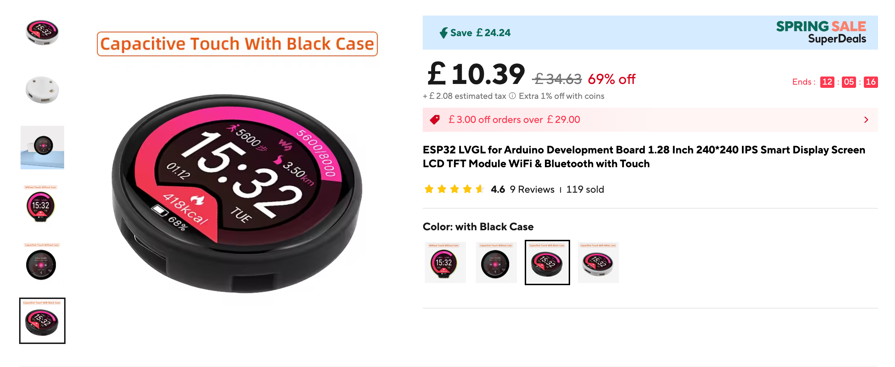

# Tally Ho!

Tally system built upon the new influx of development LCD ESP32 boards on AliExpress!

## The Idea...

Ever seen on AliExpress or similar stores a really cool ESP32 development board? One with a high resolution screen, touch support and sometimes a nice neopixel and buttons?

Something like this one:

Have you felt annoyed of the lack of standardised and cheap tally solutions?

Well, that's what i'm making here!

## Project Aims

### Short term
* Support a few different common boards in various cool form factors
* Support ATEM live switching support as the tally source
* Make it easy to configure which Tally is attached to which camera without re-programming.
* Design and 3D print a bracket to mount to the hot/cold shoe of a DSLR or similar camera.

### Longer term
* Ease deployment by using centralised power distribution:
    * ideas about PoE adapters/dongles (I have a PoE switch and lots of Cat5e!)
* Support other switchers / OBS etc

## Development

Instructions at [DEVELOPMENT.md](DEVELOPMENT.md)

## Say Hi!

Like what i'm doing here and have ideas / improvements? Issues and Merge Requests are open!
